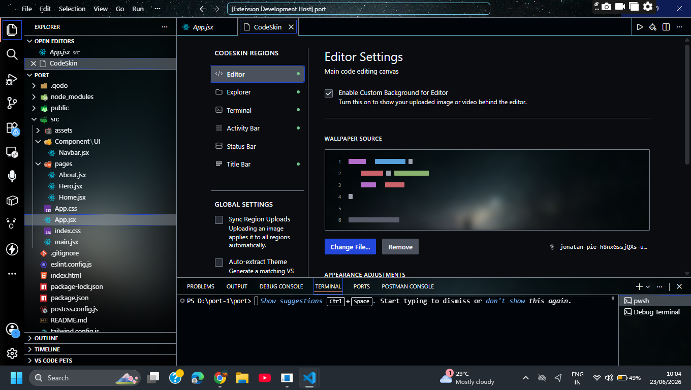
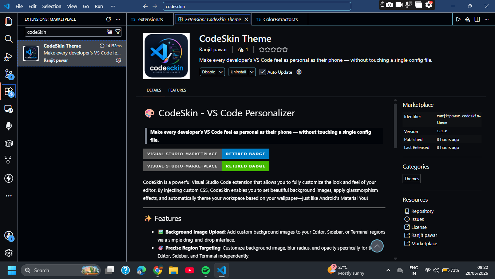
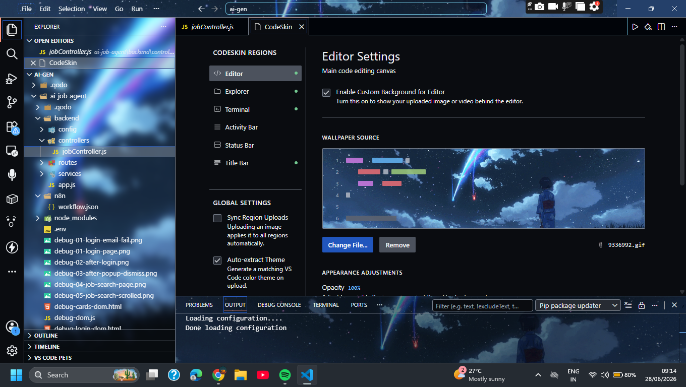

# 🎨 CodeSkin – Personalize Visual Studio Code Your Way

> **Transform VS Code into a workspace that reflects your style.**
> Add beautiful wallpapers, apply glassmorphism effects, and automatically generate themes from your favorite images—all from a simple, intuitive interface.

<p align="center">
  
  
  
  
</p>

---

# 📖 Overview

**CodeSkin** is a Visual Studio Code extension that lets you completely personalize your development environment without manually editing JSON settings.

With an easy-to-use interface, you can:

* Set custom wallpapers
* Add blur and transparency effects
* Create a modern glassmorphism look
* Automatically generate VS Code colors from your wallpaper
* Save multiple workspace styles as reusable profiles

Whether you prefer minimal, cyberpunk, anime, dark, nature, or aesthetic themes, CodeSkin helps you create a workspace you'll enjoy coding in every day.

---

# ✨ Features

## 🖼 Custom Backgrounds

Upload your favorite wallpapers directly inside VS Code.

Supports backgrounds for:

* ✅ Editor
* ✅ Explorer
* ✅ Terminal
* ✅ Activity Bar
* ✅ Status Bar
* ✅ Title Bar

Each section can have its own image.

---

## 🎛 Independent Controls

Customize every region separately.

Adjust:

* Blur
* Opacity
* Brightness
* Image Position
* Image Size
* Overlay Effects

No manual CSS editing required.

---

## 🎨 Material You Theme Extraction

Inspired by Android's **Material You**.

With one click, CodeSkin:

* Extracts dominant colors from your wallpaper
* Generates matching VS Code colors
* Creates a consistent UI theme automatically

Your editor colors adapt to your wallpaper.

---

## 💎 Glassmorphism Effects

Give VS Code a modern transparent appearance.

Features include:

* Frosted glass panels
* Soft blur
* Transparent sidebars
* Elegant overlays

Perfect for modern desktop setups.

---

## 📁 Profile Management

Save multiple workspace styles.

Example profiles:

* Work
* Night Coding
* Cyberpunk
* Anime
* Minimal
* OLED Dark

Switch between them instantly.

---

## ⚡ Fast & Lightweight

CodeSkin is optimized for performance.

* Lightweight CSS injection
* Fast image loading
* Minimal impact on VS Code performance

---

## 🎯 Simple User Interface

No configuration files.

Everything can be managed from the built-in settings panel.

* Upload images
* Change settings
* Apply themes
* Restore defaults

All with a few clicks.

---

# 📸 Preview

<p align="center">
  
</p>

### Editor Customization

* Beautiful wallpapers
* Adjustable opacity
* Blur effects
* Material You colors

<p align="center">
  
</p>

### Sidebar Personalization

* Independent background
* Glass effects
* Transparency controls

<p align="center">
  
</p>

### Terminal Styling

* Background image
* Blur
* Opacity
* Matching colors

<p align="center">
  
</p>

### Video Demonstrations

<video src="codesckin-2.mp4" controls="controls" muted="muted" width="100%"></video>

<video src="codesckin-3.mp4" controls="controls" muted="muted" width="100%"></video>

---

# 🚀 Getting Started

## 1. Install CodeSkin

Install the extension from the Visual Studio Code Marketplace.

---

## 2. Open CodeSkin

Open the Command Palette.

**Windows / Linux**

```
Ctrl + Shift + P
```

**macOS**

```
Cmd + Shift + P
```

Run:

```
CodeSkin: Open Settings
```

---

## 3. Upload Your Wallpaper

Click

```
Change File
```

or simply drag and drop an image.

Supported formats:

* PNG
* JPG
* JPEG
* WEBP

---

## 4. Customize

Adjust:

* Blur
* Opacity
* Background Position
* Overlay
* Theme Extraction

Preview changes instantly.

---

## 5. Apply Theme

Click

```
Apply
```

Your workspace updates immediately.

---

# ⚠ VS Code "Installation Corrupted" Warning

## Why does this happen?

CodeSkin customizes VS Code by safely injecting CSS into VS Code's UI.

Because internal files are modified, VS Code may display:

> **"Your installation appears to be corrupted."**

This is **expected behavior**.

It does **not** mean:

* Your computer is infected
* The extension is unsafe
* VS Code is broken

It simply means VS Code detected changes to its internal UI files.

---

## What should I do?

You can safely:

* Ignore the warning
* Click **Don't Show Again**
* Continue using VS Code normally

---

# 🔄 Restore Default VS Code

If you want to remove all customizations:

Open Command Palette

```
CodeSkin: Repair Installation
```

or

```
CodeSkin: Remove Backgrounds
```

Restart VS Code.

Everything returns to the default appearance.

---

# 🗑 Uninstall

1. Run

```
CodeSkin: Remove Backgrounds
```

2. Restart VS Code

3. Uninstall CodeSkin

No custom files remain.

---

# 📋 Requirements

* Visual Studio Code **1.85.0** or newer
* Windows, macOS, or Linux
* Write permission to the VS Code installation directory

---

# ❓ Frequently Asked Questions

### Does CodeSkin modify my source code?

**No.**

It only customizes the Visual Studio Code interface.

---

### Is it safe?

Yes.

CodeSkin only injects styling into the VS Code workbench.

It never accesses or modifies your project files.

---

### Why do I see the "Installation Corrupted" message?

Because VS Code detects that its UI files have been customized.

This is normal for extensions that inject custom CSS.

---

### Will it slow down VS Code?

No.

CodeSkin is designed to be lightweight and optimized for everyday development.

---

### Can I restore the default UI?

Yes.

Run:

```
CodeSkin: Repair Installation
```

or

```
CodeSkin: Remove Backgrounds
```

Then restart VS Code.

---

# 🛣 Roadmap

Planned features:

* ✅ Animated wallpapers (GIF & Video)
* ✅ Live wallpapers
* ✅ Wallpaper collections
* ✅ Cloud profile sync
* ✅ One-click theme sharing
* ✅ Custom CSS editor
* ✅ Workspace-specific profiles
* ✅ Community themes
* ✅ AI-powered wallpaper recommendations

---

# 🤝 Contributing

Found a bug or have a feature request?

Contributions, issues, and suggestions are always welcome.

---

# ⭐ Support the Project

If you enjoy using **CodeSkin**, please consider:

* ⭐ Starring the GitHub repository
* 📝 Leaving a review on the VS Code Marketplace
* 💬 Sharing it with other developers

Your support helps improve the extension and motivates future updates.

---

# 📄 License

Released under the **MIT License**.

---

<p align="center">

### ✨ Make VS Code feel truly yours.

**Built with ❤️ by Ranjit Pawar**

</p>

